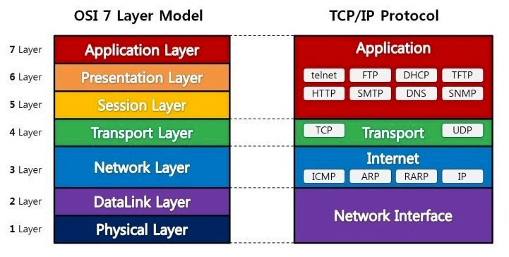
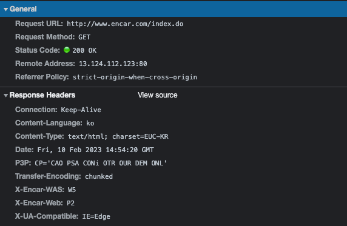
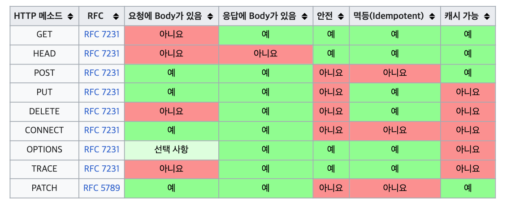

# HTTP 알아보기

---

# 웹 개발자

> 웹 개발자는 **HTTP** 프로토콜을 커뮤니케이션 매체로 사용하는 웹 페이지, 웹 사이트 등 WWW 기반 소프트웨어 개발자 또는 소프트웨어 엔지니어를 말한다. 대다수의 웹개발자들은 웹 디자인, 정보설계, 사용자 인터페이스 설계, 프로젝트 관리, 웹 서버 및 데이터베이스 관리, 웹페이지 코딩 및 프로그래밍 관련 기술을 가지고 있다.

---

# OSI 7 Layer

프로토콜을 기능별로 나눈 것

---

# 프로토콜

> 복수의 컴퓨터 사이나 중앙 컴퓨터와 단말기 사이에서 데이터 통신을 원활하게 하기 위해 필요한 통신 **규약**

---

# HTTP의 역사

- HTTP/0.9 1991년: Get 메서드만 지원
- HTTP/1.0 1996년: 메서드, 헤더 추가
- HTTP/1.1 1997년: 가장 많이 사용
  - RFC2068(1997) > RFC2616(1999) > RFC7230~7235(2014)
  - https://www.rfc-editor.org/rfc/rfc2616
  - https://www.rfc-editor.org/rfc/rfc7231

---

# HTTP의 특징

- 클라이언트 - 서버 구조
- 무상태 프로토콜, 비연결성
- 단순함, 확장 가능

---

## 클라이언트 서버구조

클라이언트가 요청을 보내야 응답이 온다

---

## 무상태, 비연결성

### 무상태
- 서버가 클라이언트의 상태를 보존하지 않는다
  - 로그인한 사용자의 상태는 어떻게?

### 비연결성
- HTTP 연결을 유지하지 않는다
- 응답 전송 후 연결을 즉시 끝낸다
  - 만약 응답이 늦어지게 되면?

---

### 한계와 극복
항상 TCP/IP 연결을 새로 맺어야 한다 (JS, CSS, IMAGE...)
- 지속연결을 이용하여 단점을 극복 (keep alive)
- 
  - 정해진 내부적인 연결 시간, 매커니즘이 있다.
- HTTP/2,3에서 최적화

---

# HTTP 메시지

요청과 응답이 이루어지는 메시지

---

## 요청 메시지

공백 하나하나가 모두 약속된 규칙이다

---

## 응답 메시지

성공하는 표준 기술은 단순하지만 확장가능한...

---

# HTTP 메서드

