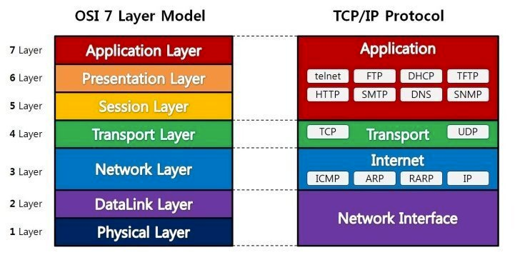
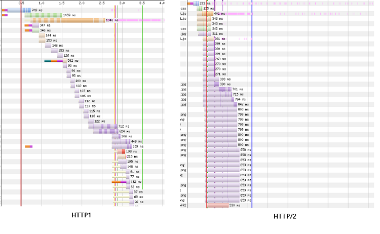
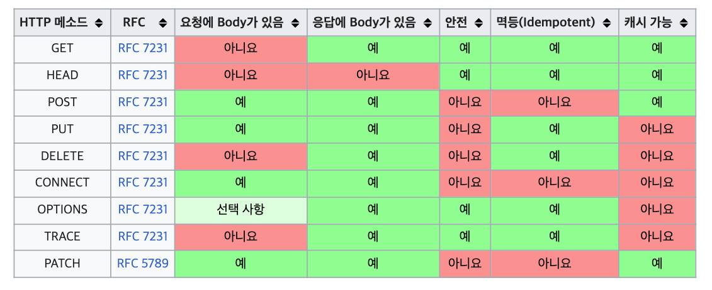

# 기초 지식

---

# 웹 개발자

> 웹 개발자는 **HTTP** 프로토콜을 커뮤니케이션 매체로 사용하는 웹 페이지, 웹 사이트 등 WWW 기반 소프트웨어 개발자 또는 소프트웨어 엔지니어를 말한다. 대다수의 웹개발자들은 웹 디자인, 정보설계, 사용자 인터페이스 설계, 프로젝트 관리, 웹 서버 및 데이터베이스 관리, 웹페이지 코딩 및 프로그래밍 관련 기술을 가지고 있다.

---

# OSI 7 Layer

- Open Systems Interconnection
- ISO(국제표준화기구)에서 개발되었으며, 네트워크의 데이터 통신을 이해하기 위해 사용되는 모델

---

# 프로토콜

> 복수의 컴퓨터 사이나 중앙 컴퓨터와 단말기 사이에서 데이터 통신을 원활하게 하기 위해 필요한 통신 **규약**

 

쉽게 말하면 약속이다

---

# HTTP의 역사

- HTTP/0.9 1991년: Get 메서드만 지원
- HTTP/1.0 1996년: 메서드, 헤더 추가
- HTTP/1.1 1997년: 가장 많이 사용
  - RFC2068(1997) > RFC2616(1999) > RFC7230~7235(2014)
  - https://www.rfc-editor.org/rfc/rfc2616
  - https://www.rfc-editor.org/rfc/rfc7231

> RFC(Request for Comments) 문서는 "의견을 요청하는 문서"라는 의미로, 국제 인터넷 표준화 기구(IETF; Internet Engineering Task Force)에서 관리하는 기술 표준

---

# HTTP의 특징

- 클라이언트 - 서버 구조
- 무상태 프로토콜, 비연결성
- 단순함, 확장 가능

---

## 클라이언트 서버구조

클라이언트가 요청을 보내야 응답이 온다

기본적으로는 이것을 기억하고 생각하자

---

## 무상태, 비연결성

### 무상태
- 서버가 클라이언트의 상태를 보존하지 않는다
  - 로그인한 사용자의 상태는 어떻게?

### 비연결성
- HTTP 연결을 유지하지 않는다
- 응답 전송 후 연결을 즉시 끝낸다
  - 만약 응답이 늦어지게 되면?

---

#### 비연결성의 사례
예제를 통해 동작을 예상해 보자

---

### 한계와 극복
항상 TCP/IP 연결을 새로 맺어야 한다 (JS, CSS, IMAGE...)
- 지속연결을 이용하여 단점을 극복 (keep alive)
- 
  - 정해진 내부적인 연결 시간, 매커니즘이 있다.
- HTTP/2,3에서 최적화

---

#### HTTP/2
HTTP/2는 하나의 TCP 연결을 통해 여러 데이터 요청을 병렬로 전송가능

---

# HTTP 메시지

요청과 응답이 이루어지는 메시지

---

## 요청 메시지

공백 하나하나가 모두 약속된 규칙이다

---

## 응답 메시지

성공하는 표준 기술은 단순하지만 확장가능한

---

## 헤더
- General Header: Connection, Date...
- Request Header: Host, User-Agent...
- Response Header: Server, Location...

---

# HTTP 메서드

🤔 브라우저에서 주소를 입력하면?

---

# HTTP 상태코드

--- 

# 3xx Redirection 처리

- 301 Moved Permanently
  - 영구 이동
  - 리다이렉트 요청을 캐시에 저장
- 302 Found
  - 임시 이동
  - 리다이렉트 요청을 캐시에 저장하지 않음

**예제**
- 301 예시 [🔗](http://fem.encar.com/login)
- 302 예시 [🔗](http://www.encar.com/index.do)

이 또한 규약이다 [🔗](https://www.rfc-editor.org/rfc/rfc7231#section-6.4.3)

---

# 웹 서버

---

## 웹 서버란?
하드웨어 측면, 소프트웨어 측면이 있다
- 하드웨어: 웹서버를 구동시키는 컴퓨터
- **소프트웨어: 웹서버 프로그램**

🤔 fem은 어떤 웹서버를 사용할까?

---

## 웹 서버의 역할

가장 기본적인 단계에서, 브라우저가 웹 서버에서 파일을 필요로 할때 브라우저는 HTTP를 통해 파일을 요청, 웹 서버는 요청된 파일을 찾아서 브라우저에게 전송한다

---

# WAS (Web Application Server)

브라우저에서 보는 최종 웹페이지를 생성하기 위해, WAS는 데이터베이스와 연동하여 데이터를 처리하고, 결과를 전달한다

---

# 정적, 동적 컨텐츠

## 정적 컨텐츠
- 웹 서버가 미리 생성된 파일을 제공하는 것
- HTML, CSS, JS, 이미지, 동영상 등

## 동적 컨텐츠
- 웹 서버가 요청에 따라 생성하는 파일을 제공하는 것
- JSP, PHP, ASP 등

🤔 WAS는?

---

# 서버 구조

🤔 fem의 구조는?

---

# 웹서버와 WAS의 역할

웹서버는 정적인 컨텐츠(HTML, CSS, JS, 이미지 등)를 제공하며, WAS는 동적인 컨텐츠(애플리케이션 로직)를 처리
이러한 역할 분담은 다음과 같은 이점을 제공

- 웹서버와 WAS를 분리함으로써, 부하를 분산할 수 있다
- 웹서버는 방화벽 기능을 수행하여, 악성요청이나 DDoS 공격을 차단할 수 있다. 또한, SSL/TLS 암호화와 복호화를 처리하는 부하를 WAS에서 분산할 수 있다
- WAS는 웹서버와 독립적으로 확장할 수 있다

---

## 웹서버의 정적 컨텐츠 처리 성능

y: 응답시간
x: 요청수

---

# 데이터 전송

## HTML Form 전송
표준 HTML 폼 전송은 데이터가 전송된 URL을 로드한다. 즉, 브라우저창 전체가 다시 로드된다 
GET, POST 방식이 있다. [🔗](https://www.encar.com/ms/ms_search.do?method=pw) [🔗](https://codesandbox.io/s/flamboyant-feistel-g2fjfi?file=/src/App.js)

## Ajax (Asynchronous JavaScript and XML)
Ajax는 웹 페이지의 일부를 로드하는 데 사용되는 기술
즉, 브라우저창 전체가 다시 로드되지 않는다.

---

# 데이터 전송 타입

요청 메시지 body(payload)에 데이터를 담아서 전송한다
Content-Type 헤더를 통해 데이터의 형식을 알려준다

- applicaiton/x-www-form-urlencoded
  - key=value&key=value (쿼리 파라미터와 유사)
- application/json
  - JSON 형식
- multipart/form-data
  - 파일 전송

---

# application/x-www-form-urlencoded

- 쿼리 파라미터와 유사한 형태로 전송
- urlencoded이기 때문에 한글, 특수문자를 인코딩하여 전송 
- 예시 [🔗](https://m.encar.com/sl/sl_sell.do?method=sellCar2&_gl=1*1k1yqy3*_ga*ODM2NTQ1MjA3LjE2NjgzMDA0NDE.*_ga_BQ7RK9J6BZ*MTY3NjExOTMyOC4xMy4xLjE2NzYxMjA0ODkuNTYuMC4w#/carestimateApply1)

🤔 만약 fem에서 해당 페이지로 연결해달라는 요구사항이? [🔗](https://codesandbox.io/s/great-night-qfdkg7?file=/src/App.js)

---

# application/json

- JSON 형식으로 전송

---

# multipart/form-data

파일 전송에 사용 [🔗](https://codesandbox.io/s/brave-moore-rmn7cz?file=/src/App.js)

- 청크 단위로 분할되어 서버로 전송
- 폼의 시작과 끝을 구분하기 위해 boundary를 사용 (끝에 --가 붙는다)

---

# 결론

**HTTP는 약속(규약)이다**
