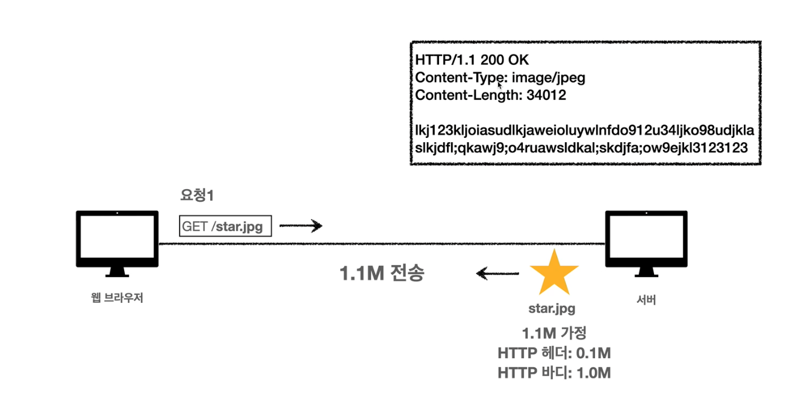
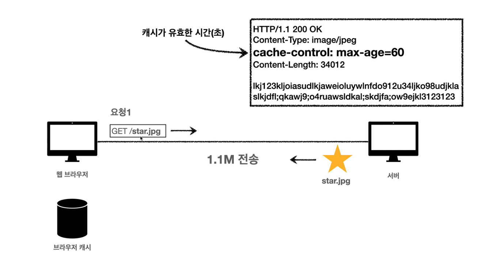
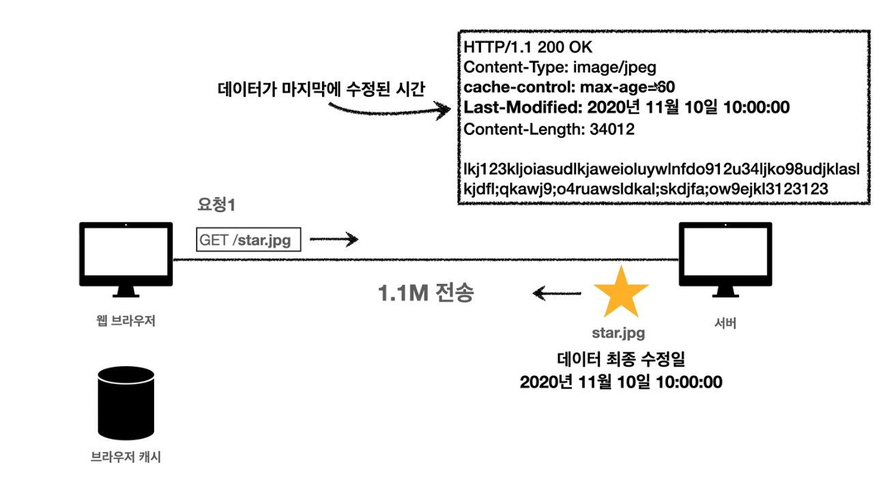
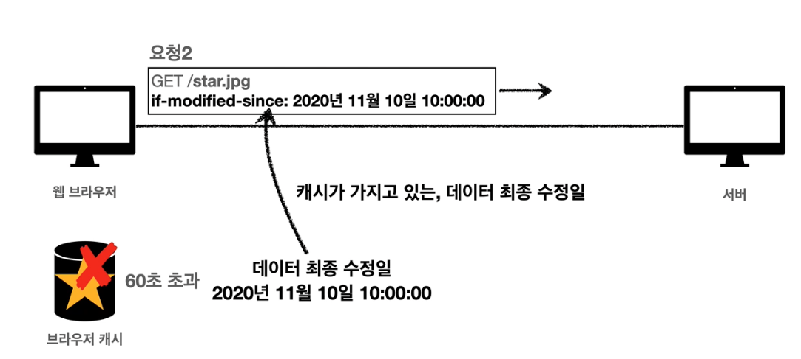
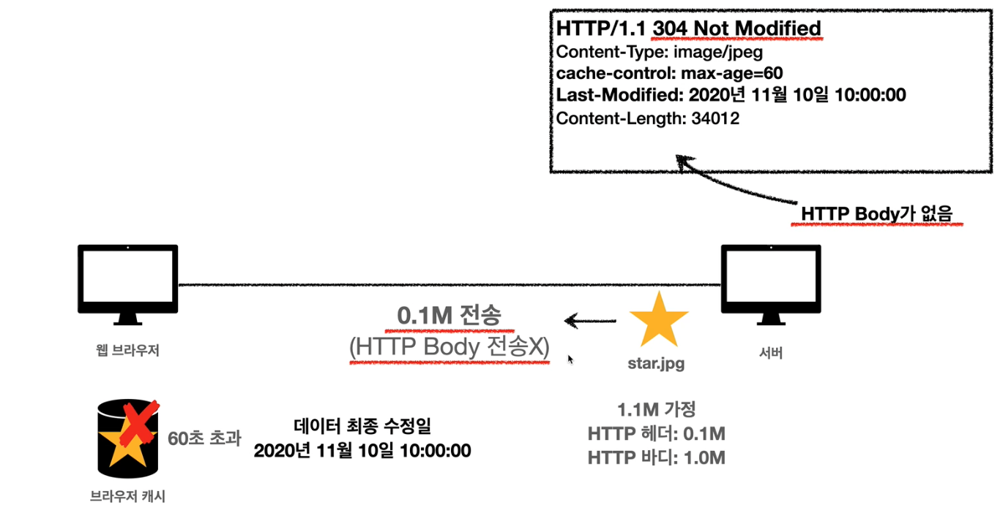

# 캐시 (Cache)

---

# 캐시란?

> 자주 사용하는 데이터나 값을 미리 복사해 놓는 임시 장소

---

# 캐시 미사용

---

# 캐시 사용

서버에서 응답헤더에 캐시 정보를 담아서 보낸다.

---

# 캐시 검증과 조건부 요청
캐시의 유효시간이 초과해서 서버에 다시 요청하면 두가지 상황이 나타난다.
- 이미지가 변경됨
- 이미지가 변경되지 않음

---

## 첫번째 요청

Last-Modified 헤더가 추가되었다. 데이터의 최종 수정일 정보 (UTC 형식)

---

## 두번째 요청

| 요청                                 | 응답                                  |
|-------------------------------------|-------------------------------------|
|  |  |  

- max-age를 초과하지 않았다면 무조건 로컬캐시를 사용한다.
- max-age를 초과했다면 서버에게 If-Modified-Since 헤더를 추가해서 요청한다.
- 서버에서 이미지가 변경되지 않았다면 304 Not Modified 응답을 보낸다.

---

## 캐시 검증 헤더
캐시 데이터와 서버 데이터가 일치하는지 검증하는 헤더
- `Last-Modified` `If-Modified-Since` 
  - 날짜 기반의 검증
  - 데이터를 수정하여 날짜는 업데이트 되지만 실제 데이터가 변경되지않은 경우 검증이 불가능
- `ETag` `If-None-Match`
  - 데이터에 태그를 달아 검증
    - `ETag: v1.0`, `ETag: a2jiodwjekl3` (해시값을 많이 사용)
  - 요청값과 서버의 값이 같으면 유지, 다르면 변경된 것으로 간주

---

## 정리

- 캐시의 유효시간이 초과하여도 서버의 데이터가 갱신되지 않으면 304 Not Modified + 헤더 메타 정보만 응답을 받는다 (Body는 없다)
- 결과적으로 네트워크 통신은 발생하지만 헤더 정보만 전송되므로 매우 실용적이다

---

# 실전 예시

캐시 동작을 확인해보자.

[fem 🔗](https://fem.encar.com/estimate)
[encar 차량이미지 🔗](http://www.encar.com/dc/dc_cardetailview.do?pageid=dc_carsearch&listAdvType=pic&carid=33749460)
